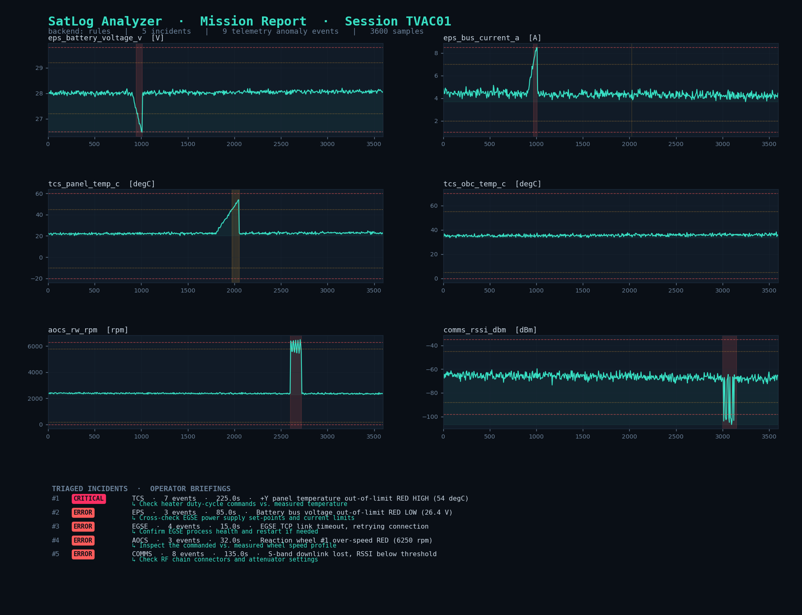

# 🛰️ AI-Assisted Satellite Test Log Analyzer (`satlog`)

A prototype tool for the **satellite Assembly, Integration & Test (AIT)** domain.
It ingests Central Check-Out System (CCS) / EGSE **test logs** and **telemetry**,
then automatically:

1. **Parses** semi-structured test logs into clean, queryable data
2. **Detects telemetry anomalies** using out-of-limit checks, rolling statistics, and an unsupervised ML model
3. **Clusters** the resulting flood of log lines into a handful of meaningful **incidents**
4. Generates **LLM-assisted operator briefings** (what happened, likely causes, recommended actions)
5. Surfaces everything in a **mission-control web dashboard** and an exportable report

> The goal is to reduce the manual, repetitive work of reviewing thousands of
> test-log lines, and to give a test operator a fast, explainable triage of
> what went wrong during a campaign.



*(Static report rendered by `satlog.report`. The live dashboard provides the
same data interactively — see below.)*

---

## Why this project

Constellation-scale satellite production means running the same functional and
environmental test campaigns over and over. Each run produces large volumes of
log and telemetry data that an engineer must sift through by hand. This is
exactly the kind of process that benefits from **AI-assisted automation**:
anomaly detection, log-noise reduction, and operator decision support.

This repo is a small, end-to-end **proof-of-concept** exploring those use cases
on realistic (synthetic) satellite test data.

---

## Quickstart

```bash
# 1. install
pip install -r requirements.txt

# 2. generate a synthetic test campaign (logs + telemetry, with embedded faults)
python -m satlog.cli generate --session TVAC01

# 3. run the full analysis and print a triage report
python -m satlog.cli analyze \
    --log data/samples/test_session_TVAC01.log \
    --telemetry data/samples/telemetry_TVAC01.csv

# 4. launch the dashboard
python -m satlog.dashboard.app
#   → open http://127.0.0.1:5000
```

Or just run the whole demo:

```bash
./run_demo.sh        # or:  make demo && make dashboard
```

---

## What it finds

The synthetic generator embeds realistic, correlated faults so the analyzer has
something genuine to recover. On the default `TVAC01` session it detects:

| Incident | Subsystem | Signature |
|---|---|---|
| Battery undervoltage sag + bus-current spike → OBC brown-out | EPS / OBC | OOL red on voltage & current, multivariate outlier, correlated log cluster |
| +Y radiator panel thermal runaway | TCS | rising trend past red-high limit |
| Reaction-wheel over-speed + torque oscillation | AOCS | OOL red + z-score, multivariate outlier |
| Intermittent S-band downlink dropouts | COMMS | repeated RSSI breaches |
| EGSE/CCS link loss | EGSE | log-only incident (no flight-hardware anomaly) |

Each incident is paired with an operator briefing explaining the likely cause
and recommended next actions.

---

## Architecture

```
                ┌─────────────┐
   test log ───▶│   parsing   │── structured events ─┐
                └─────────────┘                       │
                                                       ▼
                                              ┌──────────────────┐     ┌──────────────────────┐
                                              │ incident          │────▶│ LLM operator         │
                                              │ clustering        │     │ assistant            │
                                              │ (TF-IDF + DBSCAN) │     │ (LLM | offline rules)│
                                              └──────────────────┘     └──────────────────────┘
                ┌─────────────┐                       ▲                          │
  telemetry ───▶│  anomaly    │── anomaly events ─────┘ (time correlation)       │
                │  detection  │                                                  ▼
                └─────────────┘                                        ┌──────────────────┐
                  OOL · z-score · IsolationForest                       │  dashboard /     │
                                                                        │  report          │
                                                                        └──────────────────┘
```

| Module | Responsibility |
|---|---|
| `satlog/parsing/log_parser.py` | Tolerant regex parser → tidy `DataFrame` (keeps malformed lines, never drops data) |
| `satlog/anomaly/detector.py` | Out-of-limit + rolling z-score + `IsolationForest`, consolidated into anomaly events |
| `satlog/clustering/incidents.py` | TF-IDF (number-masked) + subsystem + time features → `DBSCAN` incident clusters |
| `satlog/llm/operator_assistant.py` | Operator briefings; auto-selects a real LLM backend or an offline knowledge-base backend |
| `satlog/llm/knowledge_base.py` | Curated AIT fault signatures (also used to ground the LLM) |
| `satlog/pipeline.py` | Orchestrates the four stages into one JSON result |
| `satlog/dashboard/` | Flask + Chart.js mission-control UI |
| `satlog/report.py` | Static matplotlib PNG report (presentation material) |
| `data/generate_data.py` | Reproducible synthetic CCS log + telemetry generator |

---

## Anomaly detection (explainable by design)

Three complementary layers, from cheap-and-explainable to learned-and-broad:

- **Out-of-limit (OOL)** — every sample is classified against red/yellow limits
  held in `satlog/config.py` (MIB-style). This is the classic CCS check.
- **Rolling z-score** — catches drifts/spikes that are still *within* absolute
  limits (e.g. a slow ramp before it breaches red).
- **IsolationForest** — an unsupervised model over *all* parameters jointly,
  catching anomalies that only appear as an unusual *combination* of values.

Every anomaly carries the method that flagged it, so the operator can see
**why** it was raised — important for trust in an AI tool used in qualification.

## LLM operator assistant (works online *and* offline)

The assistant has two interchangeable backends, selected automatically:

- **`llm`** — calls a real model (Anthropic by default) when `ANTHROPIC_API_KEY`
  is set and the SDK is installed. The knowledge base is injected as grounding
  context so answers stay anchored to domain knowledge.
- **`rules`** — a fully offline, deterministic backend built on the curated
  knowledge base. **No key, no network required.**

This means the prototype runs anywhere — including an air-gapped test
network — while still being able to leverage a frontier model when available.

```bash
# offline (default): uses the knowledge-base backend
python -m satlog.cli analyze --log ... --telemetry ...

# online: uses a real LLM
pip install anthropic
export ANTHROPIC_API_KEY=sk-...
python -m satlog.cli analyze --log ... --telemetry ... --backend llm
```

---

## Tests

```bash
pytest -q
```

Covers the parser (including malformed-line tolerance), anomaly detection
(red OOL recovery + clean-telemetry baseline), incident clustering, and the
offline assistant.

---

## Project layout

```
satlog/            core package (parsing, anomaly, clustering, llm, dashboard)
data/              synthetic data generator + generated samples
docs/              concept proposal, architecture notes, preview image
tests/             unit tests
outputs/           generated analysis JSON + report PNG (git-ignored)
```

---

## How this maps to an AIT automation / AI working-student role

This project was built around the day-to-day tasks of an AIT automation team
exploring AI:

- **Research & prototype AI use cases for integration and testing** — log
  analysis, anomaly detection, and operator assistance are all implemented here.
- **Analyse logs, telemetry, and process data to identify automation potential**
  — the incident-clustering step directly attacks the manual log-review bottleneck.
- **Prepare technical documentation & concept proposals** — see
  [`docs/CONCEPT.md`](docs/CONCEPT.md), written as an objectives/scope/risks/benefits proposal.
- **Python data/ML stack** — `pandas`, `NumPy`, `scikit-learn`, `SciPy`,
  `matplotlib`, `Flask`.
- **CCS / EGSE awareness** — the data model, limits, and fault scenarios are
  framed in check-out-system terms.

See [`docs/CONCEPT.md`](docs/CONCEPT.md) for the proposal-style write-up and
[`docs/architecture.md`](docs/architecture.md) for design notes.

## License

MIT — see [`LICENSE`](LICENSE). All data is synthetic; this repo contains no
proprietary or flight data.
